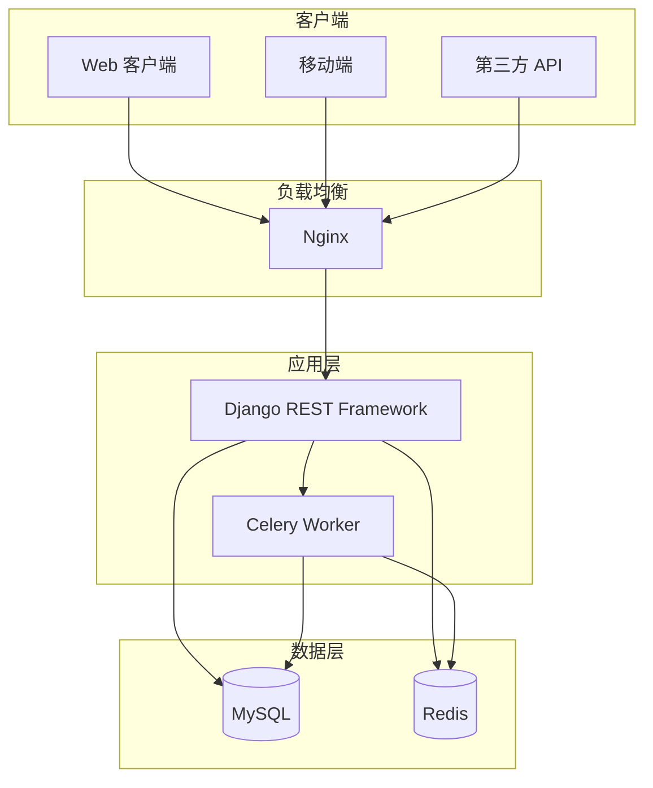
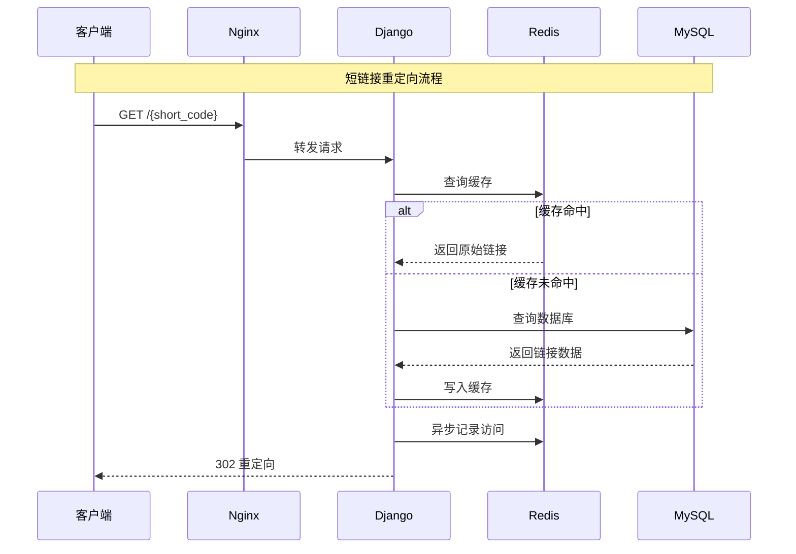
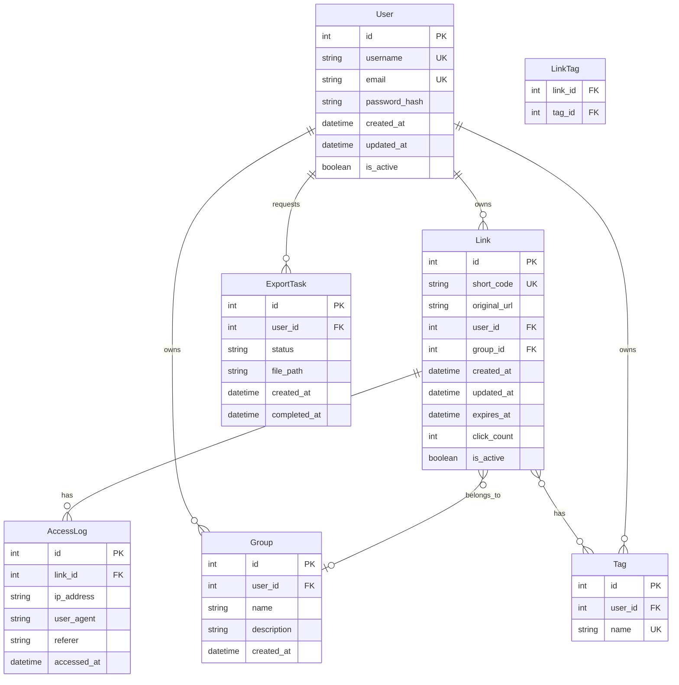

# 设计文档

## 概述

短链接服务采用 Django REST Framework 构建，遵循分层架构设计。系统使用 MySQL 作为主数据库存储链接映射和用户数据，Redis 用于缓存热点链接和实现限流功能。认证采用 JWT 方案，支持访问令牌和刷新令牌机制。

### 技术栈

- **Web 框架**: Django 4.2 + Django REST Framework 3.14
- **数据库**: MySQL 8.0
- **缓存**: Redis 7.0
- **认证**: djangorestframework-simplejwt
- **任务队列**: Celery + Redis (作为消息代理)
- **API 文档**: drf-spectacular (OpenAPI 3.0)
- **限流**: django-ratelimit + Redis

## 架构

### 系统架构图



### 请求流程



## 组件与接口

### API 端点设计

#### 认证模块 `/api/auth/`

| 端点 | 方法 | 描述 | 认证 |
|------|------|------|------|
| `/register/` | POST | 用户注册 | 否 |
| `/login/` | POST | 用户登录 | 否 |
| `/token/refresh/` | POST | 刷新令牌 | 否 |
| `/logout/` | POST | 用户登出 | 是 |
| `/profile/` | GET/PUT | 用户信息 | 是 |

#### 短链接模块 `/api/links/`

| 端点 | 方法 | 描述 | 认证 |
|------|------|------|------|
| `/` | GET | 获取链接列表 | 是 |
| `/` | POST | 创建短链接 | 是 |
| `/batch/` | POST | 批量创建 | 是 |
| `/batch/delete/` | POST | 批量删除 | 是 |
| `/{short_code}/` | GET | 获取链接详情 | 是 |
| `/{short_code}/` | PUT | 更新链接 | 是 |
| `/{short_code}/` | DELETE | 删除链接 | 是 |
| `/{short_code}/stats/` | GET | 获取统计 | 是 |

#### 重定向模块 `/r/`

| 端点 | 方法 | 描述 | 认证 |
|------|------|------|------|
| `/{short_code}` | GET | 重定向到原始链接 | 否 |

#### 分组模块 `/api/groups/`

| 端点 | 方法 | 描述 | 认证 |
|------|------|------|------|
| `/` | GET/POST | 分组列表/创建 | 是 |
| `/{id}/` | GET/PUT/DELETE | 分组详情/更新/删除 | 是 |

#### 标签模块 `/api/tags/`

| 端点 | 方法 | 描述 | 认证 |
|------|------|------|------|
| `/` | GET/POST | 标签列表/创建 | 是 |
| `/{id}/` | DELETE | 删除标签 | 是 |

#### 导出模块 `/api/export/`

| 端点 | 方法 | 描述 | 认证 |
|------|------|------|------|
| `/` | POST | 请求数据导出 | 是 |
| `/{task_id}/` | GET | 获取导出状态 | 是 |
| `/{task_id}/download/` | GET | 下载导出文件 | 是 |

### 核心服务接口

```python
# 短码生成服务
class ShortCodeGenerator:
    def generate(self, length: int = 6) -> str:
        """生成随机短码"""
        pass
    
    def validate(self, code: str) -> bool:
        """验证短码格式"""
        pass

# 链接服务
class LinkService:
    def create_link(self, user_id: int, original_url: str, 
                    custom_code: str = None, expires_at: datetime = None) -> Link:
        """创建短链接"""
        pass
    
    def get_original_url(self, short_code: str) -> str:
        """获取原始链接（带缓存）"""
        pass
    
    def record_access(self, short_code: str, ip: str, user_agent: str) -> None:
        """记录访问（异步）"""
        pass

# 统计服务
class StatsService:
    def get_link_stats(self, short_code: str) -> dict:
        """获取链接统计"""
        pass
    
    def get_daily_stats(self, short_code: str, 
                        start_date: date, end_date: date) -> list:
        """获取每日统计"""
        pass

# 限流服务
class RateLimitService:
    def check_rate_limit(self, user_id: int, is_authenticated: bool) -> tuple:
        """检查限流状态，返回 (是否允许, 剩余配额, 重置时间)"""
        pass

# URL 安全检查服务
class URLSecurityService:
    def is_safe(self, url: str) -> bool:
        """检查 URL 是否安全"""
        pass
    
    def sanitize_input(self, input_str: str) -> str:
        """清理用户输入"""
        pass
```

## 数据模型

### ER 图



### 模型定义

```python
# users/models.py
class User(AbstractUser):
    email = models.EmailField(unique=True)
    created_at = models.DateTimeField(auto_now_add=True)
    updated_at = models.DateTimeField(auto_now=True)

# links/models.py
class Link(models.Model):
    short_code = models.CharField(max_length=10, unique=True, db_index=True)
    original_url = models.URLField(max_length=2048)
    user = models.ForeignKey(User, on_delete=models.CASCADE, related_name='links')
    group = models.ForeignKey('Group', on_delete=models.SET_NULL, null=True, blank=True)
    tags = models.ManyToManyField('Tag', blank=True)
    created_at = models.DateTimeField(auto_now_add=True)
    updated_at = models.DateTimeField(auto_now=True)
    expires_at = models.DateTimeField(null=True, blank=True)
    click_count = models.PositiveIntegerField(default=0)
    is_active = models.BooleanField(default=True)

    class Meta:
        indexes = [
            models.Index(fields=['user', 'created_at']),
            models.Index(fields=['short_code']),
        ]

class AccessLog(models.Model):
    link = models.ForeignKey(Link, on_delete=models.CASCADE, related_name='access_logs')
    ip_address = models.GenericIPAddressField()
    user_agent = models.CharField(max_length=512)
    referer = models.URLField(max_length=2048, blank=True)
    accessed_at = models.DateTimeField(auto_now_add=True)

    class Meta:
        indexes = [
            models.Index(fields=['link', 'accessed_at']),
        ]

class Group(models.Model):
    user = models.ForeignKey(User, on_delete=models.CASCADE, related_name='groups')
    name = models.CharField(max_length=100)
    description = models.TextField(blank=True)
    created_at = models.DateTimeField(auto_now_add=True)

    class Meta:
        unique_together = ['user', 'name']

class Tag(models.Model):
    user = models.ForeignKey(User, on_delete=models.CASCADE, related_name='tags')
    name = models.CharField(max_length=50)

    class Meta:
        unique_together = ['user', 'name']

class ExportTask(models.Model):
    STATUS_CHOICES = [
        ('pending', '等待中'),
        ('processing', '处理中'),
        ('completed', '已完成'),
        ('failed', '失败'),
    ]
    user = models.ForeignKey(User, on_delete=models.CASCADE)
    status = models.CharField(max_length=20, choices=STATUS_CHOICES, default='pending')
    file_path = models.CharField(max_length=255, blank=True)
    created_at = models.DateTimeField(auto_now_add=True)
    completed_at = models.DateTimeField(null=True, blank=True)
```

### Redis 缓存结构

```
# 短链接缓存
link:{short_code} -> {original_url, expires_at}  # 过期时间: 1小时

# 限流计数
ratelimit:{user_id}:{window} -> count  # 过期时间: 1分钟

# 访问计数缓冲
click_buffer:{short_code} -> count  # 定期同步到 MySQL
```


## 正确性属性

*正确性属性是系统在所有有效执行中都应保持为真的特征或行为——本质上是关于系统应该做什么的形式化陈述。属性作为人类可读规范和机器可验证正确性保证之间的桥梁。*

在编写正确性属性之前，我需要分析每个验收标准的可测试性。


### 属性 1：注册-登录往返

*对于任意*有效的注册数据（用户名、邮箱、密码），注册后使用相同凭证登录应成功返回 JWT 令牌。

**验证需求: 1.1, 1.3**

### 属性 2：无效注册数据拒绝

*对于任意*无效的注册数据（空用户名、无效邮箱格式、弱密码），注册请求应被拒绝并返回相应错误信息。

**验证需求: 1.2**

### 属性 3：错误凭证拒绝

*对于任意*已注册用户和错误密码组合，登录请求应被拒绝。

**验证需求: 1.4**

### 属性 4：令牌刷新往返

*对于任意*有效的刷新令牌，刷新操作应返回新的有效访问令牌，且新令牌可用于认证请求。

**验证需求: 1.5**

### 属性 5：短链接创建-重定向往返

*对于任意*有效的原始 URL，创建短链接后访问该短码应重定向到原始 URL。

**验证需求: 2.1, 3.1**

### 属性 6：无效 URL 拒绝

*对于任意*无效格式的 URL 字符串，创建短链接请求应被拒绝并返回验证错误。

**验证需求: 2.2**

### 属性 7：短链接创建幂等性

*对于任意*已认证用户和原始 URL，多次创建相同 URL 的短链接应返回相同的短码。

**验证需求: 2.3**

### 属性 8：自定义短码使用

*对于任意*有效的自定义短码（4-10位 Base62 字符），创建短链接时指定该短码应使用该短码。

**验证需求: 2.4, 2.6**

### 属性 9：短码格式验证

*对于任意*不符合 Base62 格式或长度不在 4-10 位的短码，创建请求应被拒绝。

**验证需求: 2.6**

### 属性 10：访问计数递增

*对于任意*有效短链接，每次访问后点击计数应增加 1。

**验证需求: 3.4**

### 属性 11：访问日志记录

*对于任意*短链接访问，应记录包含 IP 地址和 User-Agent 的访问日志。

**验证需求: 3.5**

### 属性 12：链接管理 CRUD 往返

*对于任意*已认证用户创建的短链接，查询详情应返回创建时的数据；更新后查询应返回新数据；删除后查询应返回 404。

**验证需求: 4.1, 4.2, 4.3, 4.4**

### 属性 13：用户隔离

*对于任意*两个不同用户，用户 A 不能访问、修改或删除用户 B 的短链接。

**验证需求: 4.5**

### 属性 14：统计数据一致性

*对于任意*短链接，统计接口返回的点击量应等于实际访问次数。

**验证需求: 5.1**

### 属性 15：限流触发

*对于任意*用户，当请求次数超过限制（认证用户 100 次/分钟，匿名用户 20 次/分钟）时，应返回 HTTP 429。

**验证需求: 6.1, 6.2**

### 属性 16：限流配额响应头

*对于任意* API 请求，响应头应包含剩余配额信息。

**验证需求: 6.4**

### 属性 17：过期链接存储

*对于任意*带过期时间创建的短链接，查询详情应包含正确的过期时间戳。

**验证需求: 8.1**

### 属性 18：过期链接拒绝访问

*对于任意*已过期的短链接，访问应返回 HTTP 410 Gone。

**验证需求: 8.2**

### 属性 19：过期时间更新

*对于任意*短链接，更新过期时间后查询应反映新的过期时间。

**验证需求: 8.4**

### 属性 20：批量创建完整性

*对于任意*有效 URL 列表（最多 50 个），批量创建应为每个 URL 生成短链接，返回数量等于输入数量。

**验证需求: 9.1**

### 属性 21：批量创建部分成功

*对于任意*混合有效和无效 URL 的列表，批量创建应成功处理有效 URL 并为无效 URL 返回错误。

**验证需求: 9.2**

### 属性 22：批量删除完整性

*对于任意*短码列表，批量删除后所有指定链接应不可访问。

**验证需求: 9.3**

### 属性 23：分组标签管理往返

*对于任意*分组和标签，创建后应可查询；将链接分配到分组或添加标签后，查询链接应反映关联。

**验证需求: 10.1, 10.2, 10.3**

### 属性 24：分组标签筛选

*对于任意*带分组或标签的链接集合，按分组或标签筛选应只返回匹配的链接。

**验证需求: 10.4**

### 属性 25：分组删除保留链接

*对于任意*包含链接的分组，删除分组后链接应仍存在但分组字段为空。

**验证需求: 10.5**

### 属性 26：恶意 URL 拒绝

*对于任意*黑名单中的域名 URL，创建短链接请求应被拒绝。

**验证需求: 11.1, 11.2**

### 属性 27：输入清理

*对于任意*包含潜在 XSS 或 SQL 注入的输入，系统应正确清理或拒绝。

**验证需求: 11.5**

### 属性 28：数据导出完整性

*对于任意*用户的链接数据，导出的 CSV 应包含所有链接及其详情（短码、原始 URL、创建日期、点击量、标签）。

**验证需求: 12.1, 12.3**

## 错误处理

### HTTP 状态码规范

| 状态码 | 场景 |
|--------|------|
| 200 | 请求成功 |
| 201 | 资源创建成功 |
| 302 | 短链接重定向 |
| 400 | 请求参数错误 |
| 401 | 未认证或令牌无效 |
| 403 | 无权限访问资源 |
| 404 | 资源不存在 |
| 409 | 资源冲突（如短码已存在） |
| 410 | 资源已过期 |
| 429 | 请求频率超限 |
| 500 | 服务器内部错误 |

### 错误响应格式

```json
{
    "error": {
        "code": "VALIDATION_ERROR",
        "message": "请求参数验证失败",
        "details": [
            {
                "field": "original_url",
                "message": "无效的 URL 格式"
            }
        ]
    }
}
```

### 异常处理策略

1. **数据库连接失败**: 返回 503，触发告警，使用缓存降级
2. **Redis 连接失败**: 降级到数据库直接查询，记录日志
3. **外部服务超时**: 设置合理超时，返回 504 或降级响应
4. **并发冲突**: 使用乐观锁，返回 409 提示重试

## 测试策略

### 单元测试

- 测试短码生成器的唯一性和格式
- 测试 URL 验证逻辑
- 测试权限检查逻辑
- 测试限流算法

### 属性测试

使用 `hypothesis` 库进行属性测试，每个属性测试至少运行 100 次迭代。

```python
from hypothesis import given, strategies as st

# 示例：短链接创建-重定向往返测试
@given(st.text(min_size=10, max_size=200).filter(lambda x: x.startswith('http')))
def test_create_redirect_roundtrip(valid_url):
    """
    Feature: url-shortener, Property 5: 短链接创建-重定向往返
    验证需求: 2.1, 3.1
    """
    # 创建短链接
    short_code = create_link(valid_url)
    # 访问短链接
    redirect_url = get_redirect_url(short_code)
    # 验证重定向到原始 URL
    assert redirect_url == valid_url
```

### 集成测试

- 测试完整的 API 流程
- 测试数据库和缓存的一致性
- 测试认证流程
- 测试限流功能

### 测试覆盖率目标

- 单元测试覆盖率: >= 80%
- 集成测试覆盖关键业务流程
- 属性测试覆盖所有正确性属性
